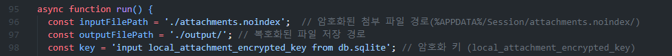
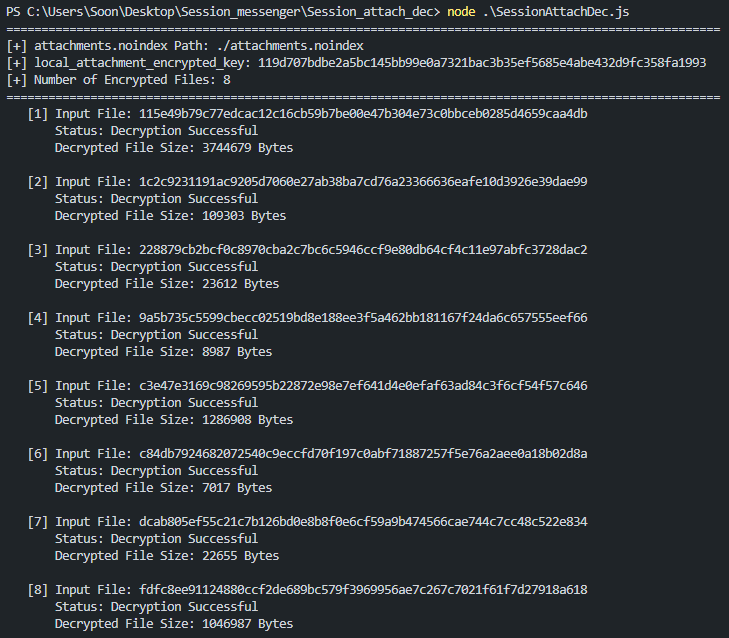

# Session-Messenger-Attach-Dec
Session 메신저(Desktop-Windows) 첨부 파일 복호화 도구

## Usage
**1. inputFilePath, outputFilePath, key 변수 수정** 

- inputFilePath: "attachments.noindex" 폴더 경로 ( '%APPDATA%\\Session\\attachments.noindex\\')
- outputFilePath: 복호화한 첨부 파일을 저장할 경로
- key: local_attachment_encrypted_key ('%APPDATA%\\Session\\sql\\db.sqlite' db 파일의 item 테이블 'local_attachment_encrypted_key' 값)

**2. "libsodium-wrappers" 라이브러리 설치**
```
npm install libsodium-wrappers
```

**3. SessionAttachDec.js 실행**
```
node SessionAttachDec.js
```


## Result

